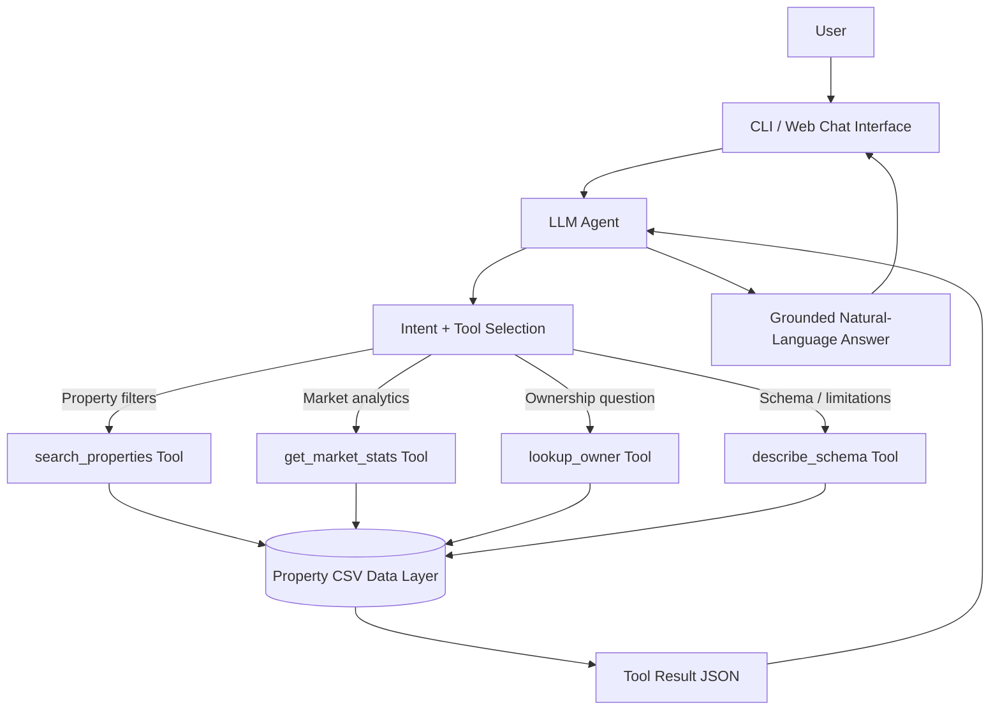

# UrbanTrace AI Search Assistant — Architecture Document

## Product Goal

UrbanTrace subscribers should be able to ask natural-language research questions over structured property data and receive clear, grounded answers. The assistant should retrieve data, reason over results, handle follow-up questions, and avoid hallucinating unsupported facts.

Example user questions:

- “Show me all SRL-owned properties in Gheorgheni 400120 that sold for over $2M in the last two years.”
- “What’s the median price per square foot in the Centru?”
- “Who owns Strada Horea 61?”

The sample dataset includes property records, ownership records, and transactions. It supports neighborhood (cartier) and ZIP-level filtering, but does not include a true neighborhood column.

---

## System Design



### Execution Flow

1. The user enters a natural-language query.
2. The LLM agent determines whether the question requires data access.
3. If data is required, the LLM calls one or more structured tools.
4. The tool executes deterministic logic over the CSV-backed data layer.
5. The tool returns JSON containing data, status, metadata, sample size, and caveats.
6. The LLM summarizes only the returned tool data.
7. The answer is returned to the user with relevant caveats.

---

## Tool Definitions

### 1. `search_properties`

Searches joined property, ownership, and transaction records.

**Input schema**

```json
{
  "neighborhood (cartier)": "string | optional",
  "zip": "string | optional",
  "neighborhood": "string | optional",
  "is_srl": "boolean | optional",
  "min_sale_price": "number | optional",
  "max_sale_price": "number | optional",
  "sold_after": "YYYY-MM-DD | optional",
  "sold_before": "YYYY-MM-DD | optional",
  "years_back": "integer | optional",
  "property_class_contains": "string | optional",
  "limit": "integer | optional"
}
```

**Output schema**

```json
{
  "status": "ok | empty | error",
  "message": "string",
  "data": [
    {
      "propkey": "integer",
      "address": "string",
      "neighborhood (cartier)": "string",
      "zip": "string",
      "property_class": "string",
      "owner_name": "string",
      "is_srl": "boolean",
      "sale_date": "YYYY-MM-DD",
      "sale_price": "integer"
    }
  ],
  "metadata": {
    "total_matches": "integer",
    "notes": ["string"]
  }
}
```

---

### 2. `get_market_stats`

Calculates market analytics from transaction and property data.

**Input schema**

```json
{
  "neighborhood (cartier)s": ["string"],
  "neighborhood (cartier)": "string | optional",
  "zip": "string | optional",
  "neighborhood": "string | optional",
  "metric": "median_price_per_sqft | avg_price_per_sqft | median_sale_price | avg_sale_price | count_sales",
  "group_by": "neighborhood (cartier) | zip | property_class | optional",
  "min_sale_price": "number | optional",
  "sold_after": "YYYY-MM-DD | optional",
  "sold_before": "YYYY-MM-DD | optional"
}
```

**Output schema**

```json
{
  "status": "ok | empty | error",
  "message": "string",
  "data": [
    {
      "metric": "string",
      "value": "number",
      "sample_size": "integer",
      "neighborhood (cartier)": "string | optional"
    }
  ],
  "metadata": {
    "metric": "string",
    "group_by": "string | null",
    "notes": ["string"]
  }
}
```

---

### 3. `lookup_owner`

Looks up current ownership by address, property key, or owner name substring.

**Input schema**

```json
{
  "address": "string | optional",
  "propkey": "integer | optional",
  "owner_name_contains": "string | optional",
  "limit": "integer | optional"
}
```

**Output schema**

```json
{
  "status": "ok | empty | needs_clarification | error",
  "message": "string",
  "data": [
    {
      "propkey": "integer",
      "address": "string",
      "neighborhood (cartier)": "string",
      "zip": "string",
      "owner_name": "string",
      "owner_type": "string",
      "is_srl": "boolean",
      "registration_date": "YYYY-MM-DD",
      "assessed_value": "integer"
    }
  ],
  "metadata": {
    "total_matches": "integer"
  }
}
```

---

### 4. `describe_schema`

Returns available datasets, columns, geographies, sale date range, and limitations.

**Input schema**

```json
{}
```

**Output schema**

```json
{
  "status": "ok",
  "message": "string",
  "data": {
    "properties": ["string"],
    "ownership": ["string"],
    "transactions": ["string"],
    "available_geographies": {
      "neighborhood (cartier)s": ["string"],
      "zip_count": "integer",
      "note": "string"
    },
    "date_range": {
      "min_sale_date": "YYYY-MM-DD",
      "max_sale_date": "YYYY-MM-DD"
    }
  }
}
```

---

## Context Management

The prototype maintains conversation history during a session. This lets the assistant support follow-ups such as:

- “What about Gheorgheni?”
- “Now only show SRL-owned properties.”
- “Who owns the first one?”

The LLM sees prior messages and tool results, so it can reuse previous filters and adjust only the requested parameter. In production, this would be expanded into structured session state containing:

```json
{
  "last_filters": {
    "neighborhood (cartier)": "Gheorgheni",
    "zip": "400120",
    "is_srl": true,
    "min_sale_price": 2000000
  },
  "last_result_set": ["propkey list"],
  "clarifications_needed": []
}
```

For enterprise use, session memory should be scoped to the authenticated user and expire after a defined retention period.

---

## Error Handling and Hallucination Prevention

### Ambiguous Queries

If a user asks “show me expensive properties,” the assistant should ask for a price threshold or safely default only if the user’s intent is obvious.

### Unsupported Fields

If the user asks for fields not in the dataset, such as “waterfront status” or “elevator condition score,” the assistant explains that those fields are unavailable and does not fabricate results.

### Neighborhood Limitations

The dataset has neighborhood (cartier) and ZIP, not a true neighborhood column. The assistant either:

- uses an explicit ZIP approximation when configured, and discloses it; or
- asks the user for a ZIP code.

### No Results

When no records match, the assistant returns an empty-result message and suggests relaxing filters.

### Bad Data

The data loader normalizes ZIP codes, dates, numeric prices, square footage, and boolean SRL flags. Invalid values are handled safely rather than crashing the session.

### Hallucination Controls

- Tool use is mandatory for factual property answers.
- Final answers are grounded in tool JSON results.
- Tool outputs include sample size and caveats.
- The assistant is instructed not to invent records or statistics.

---

## Production Architecture Extensions

A production UrbanTrace assistant would likely use:

- Postgres/BigQuery/Snowflake instead of CSV files
- Query planner with SQL generation and validation
- Role-based access control for subscribers
- Audit logs for every tool call
- Geocoder and neighborhood boundary service
- Vector search over deeds, permits, listings, and reports
- Cached analytics for common market-stat queries
- Human-readable citations back to property records
- Monitoring for tool errors, latency, and hallucination-risk events
